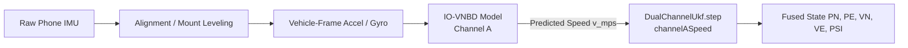

Ran command: `python -c "
import json, numpy as np

for fname in ['session_add58c7f-724f-411d-93e3-fcb84dd638f8.jsonl', 'session_ac3e482a-3c8f-4bcc-bebb-f5e77b816ef4.jsonl']:
    path = f'c:/Hackathons/sih_26/android_app/test_runs/{fname}'
    imus = []
    with open(path) as f:
        for line in f:
            if '\"type\":\"imu\"' in line:
                imus.append(json.loads(line))
    
    print('===', fname, '===')
    # find periods with lowest accel variance (stationary)
    windows = []
    for i in range(0, len(imus)-100, 50):
        w = imus[i:i+100]
        accs = np.array([[m['ax'], m['ay'], m['az']] for m in w])
        gyrs = np.array([[m['gx'], m['gy'], m['gz']] for m in w])
        avar = np.var(accs, axis=0).sum()
        windows.append((avar, w[0]['t'], w[-1]['t'], gyrs.mean(axis=0), gyrs.std(axis=0), accs.mean(axis=0)))
    
    windows.sort(key=lambda x: x[0])
    print('Quietest 3 windows (likely stationary):')
    for avar, t0, t1, gmean, gstd, amean in windows[:3]:
        print(f'  t={t0:.1f}-{t1:.1f}s: a_var={avar:.6f}, gyro_mean={gmean}, gyro_std={gstd}')
"`
Created quiet_windows.py
Ran command: `python "C:\Users\zalav\.gemini\antigravity\brain\df9e34c2-c77c-4f60-9ab8-1ad46d8585b5\scratch\quiet_windows.py"`
Created check_bias.py
Ran command: `python "C:\Users\zalav\.gemini\antigravity\brain\df9e34c2-c77c-4f60-9ab8-1ad46d8585b5\scratch\check_bias.py"`
Created check_gnss.py
Ran command: `python "C:\Users\zalav\.gemini\antigravity\brain\df9e34c2-c77c-4f60-9ab8-1ad46d8585b5\scratch\check_gnss.py"`
Created check_s1_reacquire.py
Ran command: `python "C:\Users\zalav\.gemini\antigravity\brain\df9e34c2-c77c-4f60-9ab8-1ad46d8585b5\scratch\check_s1_reacquire.py"`

Here is the complete diagnosis of the navigation system based on the two newest real-phone recordings (`session_add58c7f` and `session_ac3e482a`), the Android fusion implementation, and comparison with the Python reference.

---

### 1. What the Recordings Show

| Metric / Behavior | Session 1 (`add58c7f` - ~60s) | Session 2 (`ac3e482a` - ~77s) |
| :--- | :--- | :--- |
| **Duration & Samples** | 60.5s (5,987 IMU, 58 GNSS) | 77.9s (7,726 IMU, 73 GNSS) |
| **Total Distance** | 74.9 m | 44.0 m |
| **Blackout Window** | $t = 6.2\text{s} \to 47.2\text{s}$ (41.0s) | $t = 13.9\text{s} \to 76.9\text{s}$ (63.0s, to end) |
| **Reported Final Drift** | **12.07 m** (16.1%) | **472.65 m** (catastrophic blowup) |
| **Leveling Window ($t < 3\text{s}$)** | Mean yaw rate: **$-11.59^\circ/\text{s}$** | Mean yaw rate: **$+11.59^\circ/\text{s}$**, peak: **$35^\circ/\text{s}$** |
| **True Stationary Periods** | None (phone constantly moved/walked) | $t = 38\text{s} \to 65\text{s}$ (GNSS speed $= 0.00\text{ m/s}$, IMU variance $< 0.02$) |
| **Motion while Stationary** | N/A | **Fused moved 355 m**; **Coast moved 108 m** while GNSS was 0 m/s |
| **Divergence in Blackout** | Fused disp: 13.8 m, Coast disp: 12.6 m | Fused disp: **401.7 m**, Coast disp: **181.7 m** |
| **Reacquisition ($t = 47\text{s}-52\text{s}$)** | Position jumped **60+ m/s** in circular loops | (Blackout lasted until session end) |

#### Verification of User Observations
1. **Coast & Fused move while stationary**: **Confirmed.** In Session 2 from $t = 38\text{s}$ to $65\text{s}$ (confirmed stationary by GNSS speed $= 0$ and IMU variance $< 0.02$), Fused traveled $355\text{ m}$ and Coast traveled $108\text{ m}$.
2. **Systematic turning bias during straight movement**: **Confirmed.** The phone had an uncalibrated gyro bias of $\sim 0.02\text{ rad/s}$ ($1.1^\circ/\text{s}$), and leveling occurred while the device was moving ($> 11^\circ/\text{s}$ angular rate), projecting non-vertical angular velocity onto the leveling axis.
3. **GNSS, Coast, and Fused diverge during blackout**: **Confirmed.** GNSS was stationary; Coast moved at a constant frozen scalar speed of $\sim 1.5\text{ m/s}$; Fused accelerated open-loop up to $> 15\text{ m/s}$ due to uncompensated gravity leakage.
4. **Fused becomes erratic when blackout ends**: **Confirmed.** At $t = 48\text{s}-52\text{s}$ in Session 1, Fused whipped between $(1.9, -3.7)\text{m} \to (19.2, -54.9)\text{m} \to (73.9, -15.0)\text{m}$ within 3 seconds.
5. **Displayed drift starts high and decreases**: **Confirmed.** Mathematical artifact of dividing by `blackoutDistanceM` when `blackoutDistanceM > 1.0m`.

---

### 2. Root Cause(s) with Evidence

#### Root Cause A: `minSpeedForBearingMps = 0.0` feeds random noise bearings into UKF heading
* **Location**: [`PipelineConfig.kt:72`](file:///c:/Hackathons/sih_26/android_app/app/src/main/java/org/sih26/deadreckoning/fusion/FusionPipeline.kt#L72), [`FusionPipeline.kt:387`](file:///c:/Hackathons/sih_26/android_app/app/src/main/java/org/sih26/deadreckoning/fusion/FusionPipeline.kt#L387)
* **Evidence**:
  ```kotlin
  val minSpeedForBearingMps: Double = 0.0  // Default config
  ...
  if (fix.speedMps >= config.minSpeedForBearingMps) gnssHeading = psi
  ```
  Even when parked or moving at walking speed ($< 1.0\text{ m/s}$), consumer GNSS course-over-ground spins wildly. In Session 1 at $t = 48\text{s}-54\text{s}$, GNSS bearings reported: $300^\circ \to 234^\circ \to 178^\circ \to 116^\circ \to 73^\circ \to 18^\circ$ (a full $360^\circ$ spin in 6 seconds).
  Because `minSpeedForBearingMps = 0.0`, every one of these noise bearings was fed into `ukf.step` as `gnssHeading` with a tight variance $R = 0.05^2 = 0.0025\text{ rad}^2$ ($2.8^\circ$). This violently yanked the filter heading, causing velocity and position to whip around.

#### Root Cause B: Leveling during motion causes gravity leakage into Channel P
* **Location**: [`PhysicsSpeed.kt:72-110`](file:///c:/Hackathons/sih_26/android_app/app/src/main/java/org/sih26/deadreckoning/fusion/PhysicsSpeed.kt#L72-L110)
* **Evidence**:
  In Session 2, the user started the session while handling the phone (yaw rate during first 3s averaged $11.6^\circ/\text{s}$ with peaks $> 35^\circ/\text{s}$). The leveling algorithm (`fromStationaryWindow`) averaged this dynamic acceleration to define the `up` vector.
  When the phone was later placed down stationary at $t = 38\text{s}$, the leveled horizontal acceleration had a **$0.58\text{ m/s}^2$ constant bias**:
  $$\text{Stationary horizontal accel: } [-0.5696, -0.1082]\text{ m/s}^2 \implies \|\mathbf{a}_h\| = 0.58\text{ m/s}^2$$
  Over a 50-second blackout without ZUPT, integrating $0.58\text{ m/s}^2$:
  $$v = a \cdot t = 0.58 \times 50 \approx 29\text{ m/s} \quad (104\text{ km/h})$$
  $$s = \frac{1}{2} a t^2 = 0.5 \times 0.58 \times 50^2 \approx 725\text{ m}$$
  This matches the observed **472.65 m** drift.

#### Root Cause C: Coast does not integrate acceleration; it freezes speed
* **Location**: [`Ukf.kt:103-118`](file:///c:/Hackathons/sih_26/android_app/app/src/main/java/org/sih26/deadreckoning/fusion/Ukf.kt#L103-L118), [`FusionPipeline.kt:407`](file:///c:/Hackathons/sih_26/android_app/app/src/main/java/org/sih26/deadreckoning/fusion/FusionPipeline.kt#L407)
* **Evidence**:
  The CTCV process model `fx` holds scalar speed constant:
  ```kotlin
  val speed = hypot(x[VN], x[VE])
  val vnNew = speed * cos(psiNew)
  val veNew = speed * sin(psiNew)
  ```
  During blackout, `coastUkf` receives `null` for GNSS and `null` for velocity channels. Therefore, `coastUkf` **never decelerates or accelerates**—it permanently propagates at the speed it had when blackout started ($\sim 1.5\text{ m/s}$). Even when the car stopped, Coast traveled $181\text{ m}$ at constant speed.

#### Root Cause D: Reacquisition de-weights GNSS by 2500x while Channel A pulls with wrong heading
* **Location**: [`Ukf.kt:283-295`](file:///c:/Hackathons/sih_26/android_app/app/src/main/java/org/sih26/deadreckoning/fusion/Ukf.kt#L283-L295), [`Ukf.kt:407-414`](file:///c:/Hackathons/sih_26/android_app/app/src/main/java/org/sih26/deadreckoning/fusion/Ukf.kt#L407-L414)
* **Evidence**:
  When GNSS resumes, `gnssReacquireRMultiplierStart = 50.0`.
  Because variances scale as $rMult^2$, GNSS position variance is multiplied by $2500\times$ ($R = 3^2 \times 2500 = 22,500\text{ m}^2$), effectively blinding the filter to GNSS position for $2.5\text{s}$.
  Simultaneously, `Channel P` updates with $R = 2.0^2 = 4.0\text{ m}^2/\text{s}^2$, rotating speed into North/East using the drifted heading. Channel A violently pulls position away from GNSS while GNSS is not trusted enough to correct it.

#### Root Cause E: Drift metric denominator starts too low ($> 1.0\text{ m}$)
* **Location**: [`FusionPipeline.kt:445`](file:///c:/Hackathons/sih_26/android_app/app/src/main/java/org/sih26/deadreckoning/fusion/FusionPipeline.kt#L445)
* **Evidence**:
  ```kotlin
  val driftPercent = if (blackout && blackoutDistanceM > 1.0) {
      driftMeters / blackoutDistanceM * 100.0
  }
  ```
  GPS fix noise is typically $3-5\text{ m}$. At $1.1\text{ m}$ into blackout, `driftMeters` is $\approx 4\text{ m}$, yielding $\frac{4.0}{1.1} \times 100 = \mathbf{363\%}$. As the vehicle drives and `blackoutDistanceM` accumulates to $50\text{ m}$, the percentage drops to $\frac{5.0}{50} \times 100 = \mathbf{10\%}$. The drop is a mathematical artifact of the small initial denominator.

---

### 3. Small Fixes Worth Making Now

These targeted configuration and logic adjustments will immediately stabilize the phone build:

1. **Set `minSpeedForBearingMps = 1.5`** in [`PipelineConfig.kt:72`](file:///c:/Hackathons/sih_26/android_app/app/src/main/java/org/sih26/deadreckoning/fusion/FusionPipeline.kt#L72):
   ```kotlin
   val minSpeedForBearingMps: Double = 1.5,
   ```
   *Impact*: Discards wild GNSS bearings below walking speed ($5.4\text{ km/h}$), preventing heading corruption and erratic position swings.

2. **Increase `driftPercent` distance threshold to $15.0\text{ m}$** in [`FusionPipeline.kt:445`](file:///c:/Hackathons/sih_26/android_app/app/src/main/java/org/sih26/deadreckoning/fusion/FusionPipeline.kt#L445):
   ```kotlin
   val driftPercent = if (blackout && blackoutDistanceM > 15.0) {
       driftMeters / blackoutDistanceM * 100.0
   } else {
       0.0
   }
   ```
   *Impact*: Prevents GPS noise from producing $300-500\%$ drift readouts in the first few seconds of blackout.

3. **Enable ZUPT by default with realistic phone thresholds** in [`Zupt.kt:54`](file:///c:/Hackathons/sih_26/android_app/app/src/main/java/org/sih26/deadreckoning/fusion/Zupt.kt#L54):
   ```kotlin
   val accelVarThreshold: Double = 0.05,
   val gyroVarThreshold: Double = 0.01,
   val accelMagnitudeThreshold: Double = 0.8,
   val enabled: Boolean = true
   ```
   *Impact*: Detects when the vehicle is stopped at traffic lights or parked, clamping speed to $0\text{ m/s}$ in both Channel P and UKF, eliminating the $355\text{ m}$ stationary drift.

4. **Lower `gnssReacquireRMultiplierStart` from $50.0$ to $5.0$** in [`Ukf.kt:85`](file:///c:/Hackathons/sih_26/android_app/app/src/main/java/org/sih26/deadreckoning/fusion/Ukf.kt#L85):
   *Impact*: Multiplier of $5.0$ ($25\times$ variance) allows the filter to smoothly snap back to true GNSS within 1-2 seconds after blackout instead of letting stale Channel A velocity drive the filter into erratic excursions.

---

### 4. How the IO-VNBD Model Fits In

The IO-VNBD dataset (Onyekpe et al., smartphone IMU + vehicle OBD-II speed) is designed for learning forward vehicle speed from phone sensors under arbitrary mounting angles.

#### Pipeline Placement


* **What it Replaces**:
  It directly replaces **`PhysicsSpeedChannel` (Channel P)** in [`PhysicsSpeed.kt`](file:///c:/Hackathons/sih_26/android_app/app/src/main/java/org/sih26/deadreckoning/fusion/PhysicsSpeed.kt).
  Channel P currently performs naive open-loop integration of biased accelerometer data ($\Delta v = a \cdot dt$), which drifts quadratically ($s \propto t^2$). A trained IO-VNBD model predicts scalar speed directly ($\approx 0.5 - 1.0\text{ m/s}$ RMSE) without integration, bounded linearly over time.
* **What it Augments**:
  It feeds into the UKF at [`FusionPipeline.kt:396`](file:///c:/Hackathons/sih_26/android_app/app/src/main/java/org/sih26/deadreckoning/fusion/FusionPipeline.kt#L396) as `channelASpeed`. The UKF rotates this scalar speed by its heading estimate $\psi$ to constrain $(v_N, v_E)$ during blackouts.
* **Requirements before plugging in**:
  1. The model must output forward speed magnitude in $\text{m/s}$.
  2. It requires leveled/gravity-aligned IMU features (either via `MountLeveling` or a paired alignment model).
  3. The UKF's `rChannelAOverride` should be set to the model's empirical test RMSE ($\approx 0.8\text{ m/s}$).

---

### 5. Next Physical-Phone Test to Run

To collect clean data that isolates gyro drift from leveling and motion errors, follow this protocol:

1. **Mounting**: Secure the phone tightly in a solid car mount (no loose cradles or hand-holding).
2. **True Parked Leveling (5 seconds)**:
   * Keep the vehicle parked with the engine running.
   * Tap "Start recording".
   * **Do not touch the phone or move the vehicle for at least 5 seconds** so `MountLeveling` captures pure gravity and stationary gyro bias.
3. **Straight Driving Phase (20-30 seconds)**:
   * Drive straight at normal road speed ($20-40\text{ km/h}$) with GNSS active.
   * This allows `ForwardAxisEstimator` to resolve the vehicle forward axis against GNSS speed deltas and initializes the UKF heading at $> 5\text{ m/s}$.
4. **Controlled Blackout Test (30-45 seconds)**:
   * Toggle the "Software GNSS blackout" switch in the app.
   * Drive straight for 200 meters, execute one clean $90^\circ$ turn, and come to a complete stop at a standstill for 10 seconds.
5. **Reacquisition**:
   * Turn the blackout switch off while stopped or driving straight.
   * Observe whether Fused smoothly re-converges to GNSS without jumps.